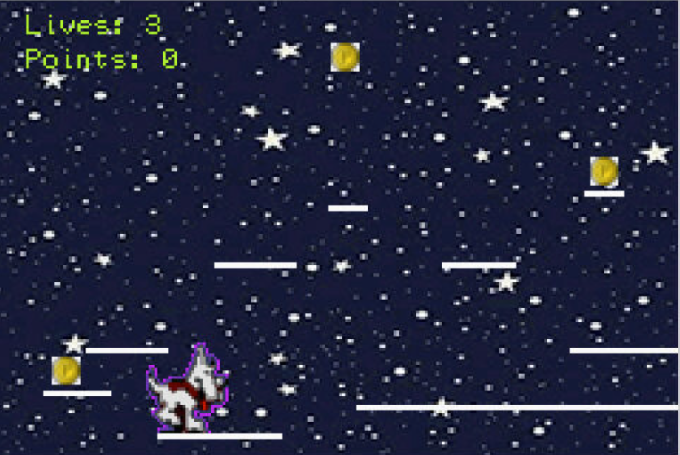

# Generic Platformer

My game is a fun exciting game where you are a dog and hop across platform! I know very original. This game has a unique combination of a nice feature called "gravity" where you can click the up arrow key to jump and the dog will quickly sink back to the ground. You can also use the horizontal arrow keys to move to the left and to the right.

## Goal

The goal of the game is to collect all three of the coins without falling off the stage three times. You are in luck though because there are walls to help you stay in bounds!

## Additional info

To start the game, or to play again after losing or winning hit the 'start' button which is mapped to the enter key. At any time during the game you can hit 'select' to return to the beginning screen which is mapped to backspace on the keyboard.

You can see your lives and points in the top left corner at all times.

